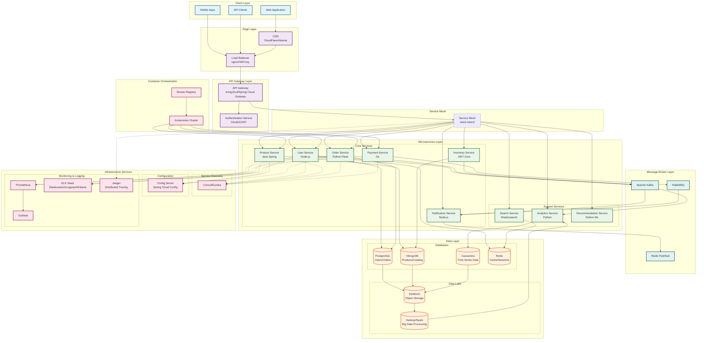

# Microservices Architecture Diagram

## High-Level System Architecture

## Architecture Components

### 1. Client Layer

- **Web Application**: React/Angular/Vue.js applications
- **Mobile Apps**: iOS/Android native or React Native apps
- **API Clients**: Third-party integrations and partners

### 2. Edge Layer

- **Load Balancer**: Distributes traffic across multiple instances
- **CDN**: Caches static content closer to users

### 3. API Gateway Layer

- **API Gateway**: Single entry point for all client requests
  - Request routing
  - Rate limiting
  - API versioning
  - Request/Response transformation
- **Authentication Service**: Centralized auth using OAuth2/JWT

### 4. Service Mesh

- **Istio/Linkerd**: Handles service-to-service communication
  - Load balancing
  - Service discovery
  - Circuit breaking
  - Retry logic
  - Observability

### 5. Microservices Layer

#### Core Services

- **User Service**: User management, profiles, authentication
- **Product Service**: Product catalog, inventory tracking
- **Order Service**: Order processing, workflow management
- **Payment Service**: Payment processing, billing
- **Inventory Service**: Stock management, availability
- **Notification Service**: Email, SMS, push notifications

#### Support Services

- **Search Service**: Full-text search capabilities
- **Analytics Service**: Business intelligence, reporting
- **Recommendation Service**: ML-based recommendations

### 6. Message Broker Layer

- **Apache Kafka**: Event streaming for high-throughput scenarios
- **RabbitMQ**: Message queuing for task distribution
- **Redis Pub/Sub**: Real-time messaging and caching

### 7. Data Layer

#### Databases (Polyglot Persistence)

- **PostgreSQL**: Relational data (users, orders)
- **MongoDB**: Document store (products, catalog)
- **Cassandra**: Time-series and high-write data
- **Redis**: Caching and session storage

#### Data Lake

- **S3/MinIO**: Object storage for backups and archives
- **Hadoop/Spark**: Big data processing and analytics

### 8. Infrastructure Services

#### Service Discovery

- **Consul/Eureka**: Dynamic service registration and discovery

#### Configuration Management

- **Config Server**: Centralized configuration management

#### Monitoring & Logging

- **Prometheus + Grafana**: Metrics collection and visualization
- **ELK Stack**: Centralized logging and log analysis
- **Jaeger**: Distributed tracing for request flow

### 9. Container Orchestration

- **Kubernetes**: Container orchestration and management
- **Docker Registry**: Container image storage

## Key Design Patterns

### 1. API Gateway Pattern

- Single entry point for clients
- Handles cross-cutting concerns

### 2. Service Discovery Pattern

- Services register themselves
- Dynamic routing based on availability

### 3. Circuit Breaker Pattern

- Prevents cascading failures
- Implemented in service mesh

### 4. Event Sourcing Pattern

- Kafka for event streaming
- Enables event replay and auditing

### 5. CQRS Pattern

- Separate read and write models
- Optimized for different use cases

### 6. Saga Pattern

- Distributed transaction management
- Compensating transactions for rollbacks

## Communication Patterns

### Synchronous Communication

- REST APIs over HTTP/HTTPS
- gRPC for internal service communication
- GraphQL for flexible client queries

### Asynchronous Communication

- Event-driven via Kafka
- Message queues via RabbitMQ
- Pub/Sub via Redis

## Security Considerations

1. **API Gateway Security**
   - Rate limiting
   - DDoS protection
   - API key management

2. **Service-to-Service Security**
   - mTLS in service mesh
   - Service authentication
   - Encrypted communication

3. **Data Security**
   - Encryption at rest
   - Encryption in transit
   - Data masking and tokenization

## Scalability Features

1. **Horizontal Scaling**
   - Each microservice scales independently
   - Auto-scaling based on metrics

2. **Database Scaling**
   - Read replicas for PostgreSQL
   - Sharding for MongoDB
   - Partitioning for Cassandra

3. **Caching Strategy**
   - Redis for application cache
   - CDN for static content
   - API response caching

## Deployment Strategy

1. **CI/CD Pipeline**
   - GitLab CI/Jenkins for build automation
   - Automated testing
   - Blue-green deployments
   - Canary releases

2. **Container Strategy**
   - Docker containers for all services
   - Kubernetes for orchestration
   - Helm charts for deployment

3. **Environment Management**
   - Development
   - Staging
   - Production
   - Disaster Recovery

## Monitoring and Observability

1. **Metrics**
   - Application metrics (Prometheus)
   - Infrastructure metrics
   - Business metrics

2. **Logging**
   - Centralized logging (ELK)
   - Structured logging
   - Log aggregation

3. **Tracing**
   - Distributed tracing (Jaeger)
   - Request flow visualization
   - Performance bottleneck identification

## Benefits of This Architecture

1. **Scalability**: Each service scales independently
2. **Resilience**: Failure isolation prevents system-wide outages
3. **Technology Diversity**: Use best tool for each job
4. **Team Autonomy**: Teams own their services
5. **Faster Development**: Parallel development and deployment
6. **Easy Maintenance**: Smaller, focused codebases

## Challenges to Consider

1. **Complexity**: Distributed system complexity
2. **Network Latency**: Inter-service communication overhead
3. **Data Consistency**: Eventual consistency challenges
4. **Testing**: Integration testing complexity
5. **Monitoring**: Need comprehensive observability
6. **Operational Overhead**: More services to manage
