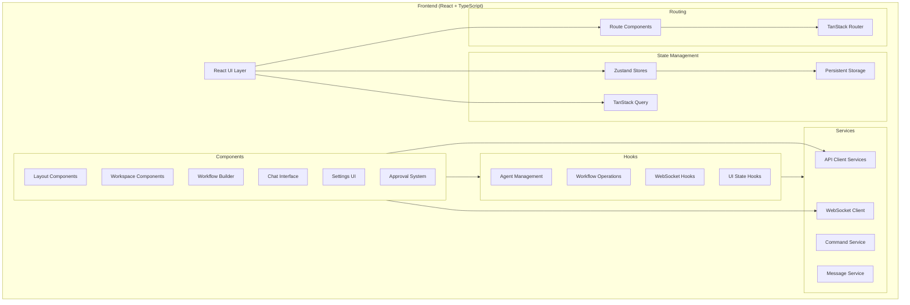
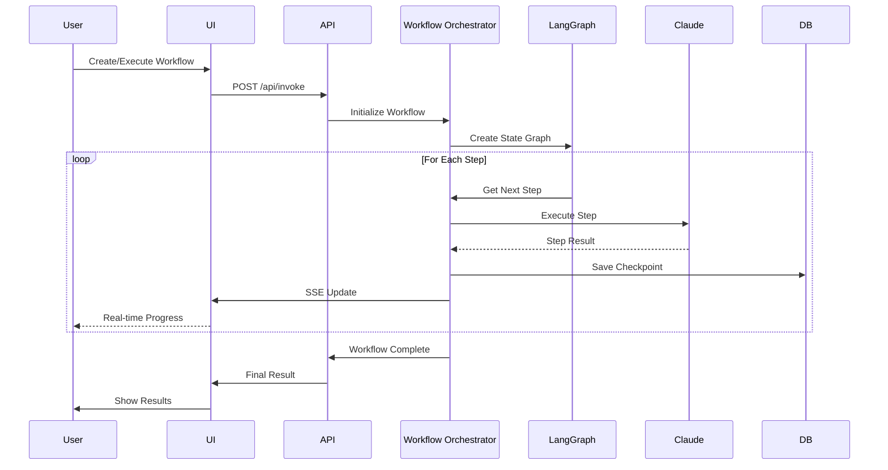

# Claude Studio: Comprehensive Architecture and Feature Documentation

## Table of Contents

1. [Architecture Diagrams](#architecture-diagrams)
2. [Technology Stack](#technology-stack)
3. [Feature Inventory](#feature-inventory)
4. [Integration Points](#integration-points)

## Architecture Diagrams

### 1. Frontend Architecture



### 2. Backend Architecture

```mermaid
graph TB
    subgraph "Backend (Express + TypeScript)"
        Express[Express Server]

        subgraph "API Layer"
            REST[REST Endpoints]
            SSE[Server-Sent Events]
            WebSocket[Socket.IO Server]
        end

        subgraph "Services"
            Claude[Claude Service]
            WO[Workflow Orchestrator]
            AS[Approval Service]
            SS[Session Service]
            TS[Tool Service]
            ES[Event System]
            DB[Database Service]
        end

        subgraph "Storage"
            SQLite[SQLite Database]
            PostgreSQL[PostgreSQL<br/>(LangGraph Checkpoints)]
            FileSystem[File System<br/>(Session JSONLs)]
        end

        subgraph "Integrations"
            ClaudeSDK[Claude Code SDK]
            LangGraph[LangGraph]
            MCP[MCP Servers]
            Redis[Redis Pub/Sub]
        end

        subgraph "Executors"
            MockExec[Mock Executor]
            ClaudeExec[Claude Executor]
            OpExec[Operator Executor]
            JSExec[JavaScript Executor]
        end
    end

    Express --> REST
    Express --> SSE
    Express --> WebSocket
    REST --> Services
    Services --> Storage
    Services --> Integrations
    WO --> Executors
    ES --> Redis
```

### 3. Full System Architecture

```mermaid
graph TB
    subgraph "Client Layer"
        Browser[Web Browser]
        ClaudeDesktop[Claude Desktop<br/>(MCP Client)]
    end

    subgraph "Application Layer"
        Frontend[React Frontend<br/>Port 5173/3457]
        Backend[Express Backend<br/>Port 3456]
        MCPServer[Studio AI MCP Server]
    end

    subgraph "Service Layer"
        ClaudeAPI[Claude API]
        LangChain[LangChain/LangGraph]
        EventBus[Redis Event Bus]
    end

    subgraph "Storage Layer"
        AppDB[(SQLite<br/>App Data)]
        CheckpointDB[(PostgreSQL<br/>Workflow State)]
        Sessions[Session Files<br/>(JSONL)]
    end

    Browser <--> Frontend
    Frontend <--> Backend
    ClaudeDesktop <--> MCPServer
    MCPServer <--> Backend
    Backend <--> ClaudeAPI
    Backend <--> LangChain
    Backend <--> EventBus
    Backend --> AppDB
    LangChain --> CheckpointDB
    Backend --> Sessions

    Frontend -.->|WebSocket| Backend
    Frontend -.->|SSE| Backend
```

### 4. Data Flow Diagram (Workflow Execution)



## Technology Stack

### Frontend Technologies

| Category               | Technology              | Purpose                    |
| ---------------------- | ----------------------- | -------------------------- |
| **Framework**          | React 19.1.0            | UI component library       |
| **Language**           | TypeScript 5.8.3        | Type-safe JavaScript       |
| **Routing**            | TanStack Router 1.122.0 | File-based routing         |
| **State Management**   | Zustand 5.0.6           | Global state management    |
| **Data Fetching**      | TanStack Query 5.83.0   | Server state management    |
| **HTTP Client**        | Ky 1.8.1                | Modern fetch wrapper       |
| **WebSocket**          | Socket.IO Client 4.8.1  | Real-time communication    |
| **UI Components**      | Radix UI                | Headless component library |
| **Styling**            | Tailwind CSS 4.0.0      | Utility-first CSS          |
| **Build Tool**         | Vite 7.0.4              | Fast development server    |
| **Testing**            | Vitest 3.2.4            | Unit testing framework     |
| **Code Editor**        | TipTap 2.23.0           | Rich text editor           |
| **Flow Visualization** | ReactFlow 11.11.4       | Node-based UI              |

### Backend Technologies

| Category            | Technology              | Purpose                    |
| ------------------- | ----------------------- | -------------------------- |
| **Runtime**         | Node.js + TSX           | TypeScript execution       |
| **Framework**       | Express 5.1.0           | Web server framework       |
| **Language**        | TypeScript 5.8.3        | Type-safe JavaScript       |
| **WebSocket**       | Socket.IO 4.8.1         | Real-time server           |
| **Database**        | SQLite (better-sqlite3) | Application data           |
| **ORM**             | Drizzle 0.44.2          | Database toolkit           |
| **AI SDK**          | Claude Code SDK 1.0.35  | Claude integration         |
| **Orchestration**   | LangGraph 0.3.6         | Workflow execution         |
| **Checkpoints**     | PostgreSQL              | Workflow state persistence |
| **Event Bus**       | Redis 5.6.0             | Cross-server events        |
| **Process Manager** | PM2 (optional)          | Production deployment      |
| **API Docs**        | Swagger                 | API documentation          |

### External Integrations

| Service          | Purpose                   | Status                  |
| ---------------- | ------------------------- | ----------------------- |
| **Claude API**   | AI agent execution        | ✅ Full integration     |
| **OpenAI API**   | Alternative LLM support   | ✅ Via LangChain        |
| **MCP Protocol** | Tool server communication | ✅ Studio AI server     |
| **Docker**       | Containerization          | ✅ Dockerfile included  |
| **PostgreSQL**   | Workflow checkpoints      | ✅ Optional feature     |
| **Redis**        | Event distribution        | ✅ Multi-server support |

## Feature Inventory

### Core Features

| Feature                     | Description                                 | Location                                             | Status           | Dependencies   | Notes                       |
| --------------------------- | ------------------------------------------- | ---------------------------------------------------- | ---------------- | -------------- | --------------------------- |
| **Multi-Agent System**      | Multiple Claude agents with different roles | UI: AgentCard, API: /api/agents                      | ✅ 100% Complete | Claude SDK     | Short IDs (dev_01, etc.)    |
| **Project Management**      | Workspace organization for agents           | UI: /workspace, API: /api/studio-projects            | ✅ 100% Complete | SQLite         | Full CRUD operations        |
| **Agent Configuration**     | Create/edit agent prompts and settings      | UI: CreateAgentModal, API: /api/agents               | ✅ 100% Complete | -              | Includes tool permissions   |
| **Tool Permissions**        | Granular control over agent capabilities    | UI: ToolPermissionEditor, API: /api/tool-permissions | ✅ 100% Complete | Tool Discovery | Dynamic tool detection      |
| **Team Templates**          | Pre-configured agent teams                  | UI: /teams, API: /api/teams                          | ✅ 100% Complete | -              | Import/export support       |
| **Chat Interface**          | Real-time agent communication               | UI: ChatPanel, MessageHistoryViewer                  | ✅ 100% Complete | WebSocket      | Streaming responses         |
| **Command System**          | #commands for agent control                 | CommandService, CommandRegistry                      | ✅ 100% Complete | -              | #spawn, #team, #clear, etc. |
| **@Mention System**         | Inter-agent communication                   | MessageParser, useMessageOperations                  | ✅ 100% Complete | -              | Routes through server       |
| **WebSocket Communication** | Real-time updates                           | useWebSocket, Socket.IO                              | ✅ 100% Complete | Redis adapter  | Cross-server support        |

### Workflow Features

| Feature                     | Description                 | Location                               | Status           | Dependencies | Notes                      |
| --------------------------- | --------------------------- | -------------------------------------- | ---------------- | ------------ | -------------------------- |
| **Visual Workflow Builder** | Drag-drop workflow creation | UI: VisualWorkflowBuilder              | ✅ 100% Complete | ReactFlow    | Conditional nodes included |
| **Workflow Execution**      | Multi-agent orchestration   | API: /api/invoke, WorkflowOrchestrator | ✅ 100% Complete | LangGraph    | Production-ready           |
| **Conditional Nodes**       | n8n-style condition builder | ConditionalNode, ConditionBuilderModal | ✅ 100% Complete | -            | Structured conditions v2.0 |
| **Workflow Persistence**    | Save/load workflows         | API: /api/workflows/saved              | ✅ 100% Complete | SQLite       | Project/global scopes      |
| **Workflow Templates**      | Reusable workflow patterns  | WorkflowLibrary                        | ✅ 100% Complete | -            | Examples included          |
| **Dependency Resolution**   | {stepId.output} variables   | WorkflowOrchestrator                   | ✅ 100% Complete | -            | Template system            |
| **Parallel Execution**      | Concurrent step execution   | LangGraph integration                  | ✅ 100% Complete | -            | Automatic optimization     |
| **Resume Functionality**    | Continue failed workflows   | API: /api/invoke with threadId         | ✅ 100% Complete | PostgreSQL   | Session preservation       |
| **Mock Execution**          | Test without API calls      | MockStepExecutor                       | ✅ 100% Complete | -            | USE_MOCK_AI=true           |
| **SSE Streaming**           | Real-time workflow updates  | API: /api/invoke-status/:threadId      | ✅ 100% Complete | -            | Event-based updates        |

### Advanced Features

| Feature                     | Description              | Location                             | Status             | Dependencies | Notes                       |
| --------------------------- | ------------------------ | ------------------------------------ | ------------------ | ------------ | --------------------------- |
| **Human Approval Nodes**    | Workflow approval gates  | API: /api/approvals                  | ⚠️ 80% Complete    | -            | Backend ready, UI partial   |
| **Loop Nodes**              | Iteration support        | -                                    | ❌ Not Implemented | -            | Removed from UI             |
| **Human Input Nodes**       | User data collection     | -                                    | ❌ Not Implemented | -            | Removed from UI             |
| **Operator System**         | Context-aware evaluation | SimpleOperator, OperatorStepExecutor | ✅ 100% Complete   | -            | No hardcoded keywords       |
| **Session Management**      | Claude session tracking  | StudioSessionService                 | ✅ 100% Complete   | -            | JSONL file parsing          |
| **Cross-Project Workflows** | Share across projects    | Workflow scopes                      | ✅ 100% Complete   | -            | Global/cross-project        |
| **Workflow Import/Export**  | Backup and sharing       | -                                    | ⚠️ 50% Complete    | -            | Import from executions only |
| **Execution History**       | View past runs           | ExecutionHistoryModal                | ✅ 100% Complete   | -            | With filtering              |
| **Batch Operations**        | Process multiple items   | BatchExecutor                        | ⚠️ 70% Complete    | -            | Core logic complete         |

### UI/UX Features

| Feature                | Description             | Location               | Status           | Dependencies | Notes                    |
| ---------------------- | ----------------------- | ---------------------- | ---------------- | ------------ | ------------------------ |
| **Dark Mode**          | Theme switching         | ThemeContext, useTheme | ✅ 100% Complete | next-themes  | System preference        |
| **Canvas Mode**        | Alternative chat view   | CanvasContent          | ✅ 100% Complete | -            | Uses existing chat       |
| **Split View**         | Multiple agents visible | SplitView component    | ✅ 100% Complete | -            | 2-4 agents               |
| **Grid View**          | Overview of all agents  | GridView component     | ✅ 100% Complete | -            | Responsive layout        |
| **Single View**        | Focus on one agent      | SingleView component   | ✅ 100% Complete | -            | Default view             |
| **Global Chat**        | System-wide assistant   | GlobalChat component   | ⚠️ 70% Complete  | -            | Basic implementation     |
| **Search**             | Find messages/sessions  | SessionSearch          | ⚠️ 60% Complete  | -            | UI exists, needs backend |
| **Keyboard Shortcuts** | Power user features     | useShortcuts           | ✅ 100% Complete | -            | Customizable             |
| **Connection Status**  | Network indicators      | ConnectionStatusBanner | ✅ 100% Complete | -            | Auto-reconnect           |

### Settings & Configuration

| Feature                    | Description          | Location          | Status           | Dependencies | Notes            |
| -------------------------- | -------------------- | ----------------- | ---------------- | ------------ | ---------------- |
| **AI Capabilities**        | Model configuration  | AICapabilitiesTab | ✅ 100% Complete | -            | Multiple models  |
| **MCP Configuration**      | Server management    | MCPTab            | ✅ 100% Complete | -            | Add/edit servers |
| **Orchestration Settings** | Workflow preferences | OrchestrationTab  | ❌ Placeholder   | -            | UI only          |
| **System Settings**        | App preferences      | SystemSettingsTab | ❌ Placeholder   | -            | UI only          |
| **Hooks Configuration**    | Event handlers       | HooksSettingsTab  | ⚠️ 30% Complete  | -            | Basic list only  |
| **Storage Management**     | Data cleanup         | StorageManagement | ✅ 100% Complete | -            | Clear data       |

### MCP Tools

| Tool Category           | Tools                                                                                     | Status           | Notes                 |
| ----------------------- | ----------------------------------------------------------------------------------------- | ---------------- | --------------------- |
| **Agent Management**    | list_agents, create_agent, update_agent, delete_agent, get_agent_config                   | ✅ 100% Complete | Full CRUD             |
| **Project Management**  | list_projects, create_project, update_project, delete_project, get_project                | ✅ 100% Complete | Studio projects       |
| **Team Management**     | add_agent_to_project, add_team_to_project, remove_agent_from_project, list_project_agents | ✅ 100% Complete | Short IDs             |
| **Workflow Execution**  | invoke, invoke_async, invoke_status, get_roles                                            | ✅ 100% Complete | Production-ready      |
| **Workflow Building**   | create_workflow, add_workflow_step, validate_workflow, execute_workflow                   | ✅ 100% Complete | Programmatic creation |
| **Workflow Storage**    | save_workflow, load_workflow, list_saved_workflows, delete_saved_workflow                 | ✅ 100% Complete | Persistent storage    |
| **Workflow Management** | list_workflows, delete_workflow, bulk_delete_workflows, cleanup_old_workflows             | ✅ 100% Complete | Maintenance tools     |
| **Tool Permissions**    | list_all_tools, get_tool_permission_presets, update_agent_tool_permissions                | ✅ 100% Complete | Dynamic permissions   |
| **MCP Servers**         | list_mcp_servers, add_mcp_server, update_mcp_server, delete_mcp_server                    | ✅ 100% Complete | Server config         |
| **Research**            | execute_research                                                                          | ✅ 100% Complete | o3-mini-online model  |

## Integration Points

### Claude SDK Integration

```typescript
// Location: web/server/services/claude-agent.ts
- Direct SDK usage for agent creation
- Session management with unique IDs
- Tool permission enforcement
- Streaming response handling
- Abort/interrupt support
```

### WebSocket Architecture

```typescript
// Multiple layers of real-time communication:
1. Frontend ↔ Backend: Socket.IO with rooms
2. Cross-server: Redis pub/sub adapter
3. Event types:
   - agent:message
   - agent:status-changed
   - workflow:update
   - project-agents-updated
```

### Database Architecture

```sql
-- SQLite (Application Data)
- agentConfigs: Agent configurations
- studioProjects: Project metadata
- agentRoleAssignments: Agent-project mappings
- saved_workflows: Workflow definitions
- teamConfigurations: Team templates

-- PostgreSQL (Optional - Workflow State)
- checkpoints: LangGraph execution state
- checkpoint_metadata: Workflow metadata
- checkpoint_writes: State transitions
```

### MCP Server Integration

```json
// Configuration Template Variables:
{
  "CLAUDE_STUDIO_API": "{CLAUDE_STUDIO_API}",
  "CLAUDE_STUDIO_PROJECT_ID": "{PROJECT_ID}",
  "PROJECT_NAME": "{PROJECT_NAME}",
  "PROJECT_PATH": "{PROJECT_PATH}",
  "AGENT_ID": "{AGENT_ID}",
  "SESSION_ID": "{SESSION_ID}"
}
```

### Docker Deployment

```yaml
services:
  app:
    - Express server on port 3456
    - Health checks enabled
    - Volume mounts for data persistence

  postgres:
    - Optional for workflow checkpoints
    - Health checks with pg_isready

  redis:
    - Optional for multi-instance deployment
    - Enables cross-server event distribution
```

## Architecture Decisions

### Why Monolithic over Distributed

- **Original Plan**: Multiple agent processes with IPC
- **Current Design**: Single process with multiple SDK instances
- **Benefits**: Simpler, more reliable, easier debugging
- **Trade-offs**: Less isolation, single point of failure

### State Management Strategy

- **Frontend**: Zustand for UI state, TanStack Query for server state
- **Backend**: In-memory for active sessions, SQLite for persistence
- **Real-time**: WebSocket for live updates, SSE for workflows

### Security Considerations

- Tool permissions enforced at SDK level
- Path validation for file operations
- Structured condition evaluation (no eval())
- Environment variable isolation per project

## Performance Optimizations

- Virtual scrolling for message lists
- Lazy loading of workflow graphs
- Redis caching for cross-server events
- Mock executor for testing (no API calls)
- Parallel workflow execution via LangGraph

## Future Enhancements

1. Complete human approval UI
2. Implement loop and human input nodes
3. Advanced hook system with visual builder
4. Workflow version control
5. Collaborative editing support
6. Performance monitoring dashboard
7. Plugin system for custom nodes
8. Export workflows to code
