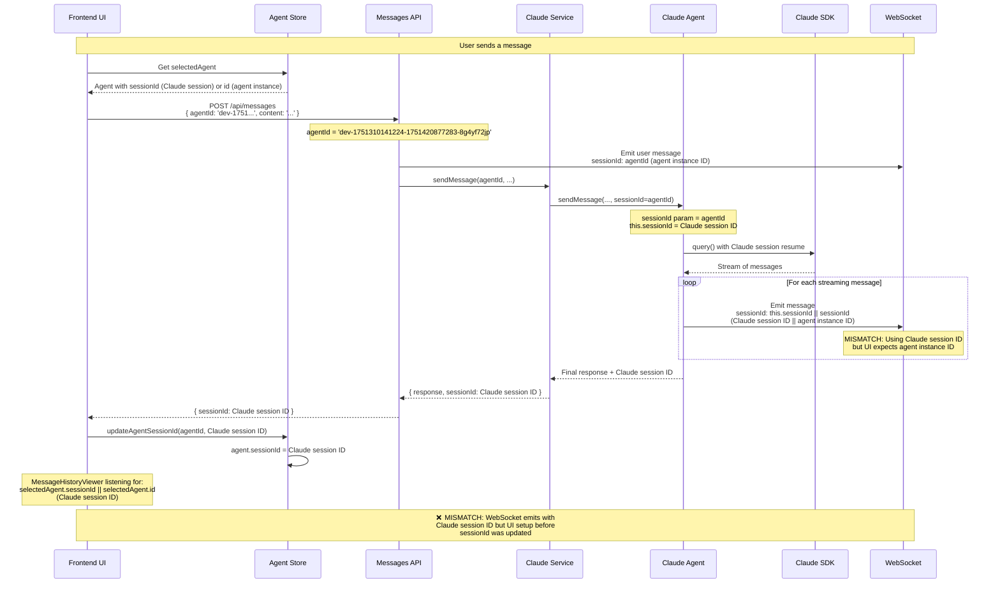

# Session ID Flow Analysis

## Problem Statement

Real-time streaming messages are not appearing in the UI due to session ID mismatch between WebSocket emissions and frontend expectations.

## Session ID Types

1. **Agent Instance ID**: Unique identifier for each agent instance (e.g., `'dev-1751310141224-1751420877283-8g4yf72jp'`)
2. **Claude Session ID**: Claude Code's internal session identifier (e.g., `'1de34715-e8e6-477a-a472-5335353dcfa6'`)

## Current Flow Sequence Diagram



## Root Cause Analysis

### The Mismatch

1. **Initial Setup**: UI sets up MessageHistoryViewer with `selectedAgent.sessionId || selectedAgent.id`
   - If no prior session: uses `selectedAgent.id` (agent instance ID)
   - If session exists: uses `selectedAgent.sessionId` (Claude session ID)

2. **WebSocket Emissions**: Backend emits with `this.sessionId || sessionId`
   - `this.sessionId` = Claude session ID (once established)
   - `sessionId` parameter = agent instance ID

3. **Timing Issue**:
   - First message: UI listens for agent instance ID, WebSocket emits with agent instance ID ✅
   - Subsequent messages: UI listens for Claude session ID, WebSocket emits with Claude session ID ✅
   - **BUT**: If UI is set up before sessionId is updated in store, mismatch occurs ❌

## Current Backend Code Issues

### In `claude-agent.ts`

```typescript
// PROBLEMATIC: Mixed session ID usage
const effectiveSessionId = this.sessionId || sessionId
// this.sessionId = Claude session ID (dynamic)
// sessionId = agent instance ID (parameter)
```

### In `messages.ts`

```typescript
// INCONSISTENT: Uses agent instance ID
const effectiveSessionId = agentId
```

## Proposed Solutions

### Option 1: Always Use Agent Instance ID for WebSocket (Recommended)

- **Pro**: Consistent, predictable session routing
- **Pro**: No timing issues
- **Con**: Need to map to Claude sessions for API calls

### Option 2: Always Use Claude Session ID for WebSocket

- **Pro**: Matches Claude's internal session tracking
- **Con**: Complex timing coordination needed
- **Con**: Must ensure UI updates before WebSocket emissions

### Option 3: Hybrid Approach with Explicit Mapping

- Use agent instance ID for UI routing
- Maintain mapping table for Claude session lookup
- Most complex but most flexible

## Recommended Fix

**Use Agent Instance ID consistently for WebSocket communications:**

1. **Backend WebSocket**: Always emit with agent instance ID
2. **Frontend**: Always listen with agent instance ID
3. **Session Mapping**: Keep Claude session mapping separate for API calls

This eliminates timing dependencies and ensures consistent message routing.

## Testing Verification

To verify the fix:

1. Send a message to an agent
2. Check browser console for WebSocket message logs
3. Verify `dataSessionId` matches `currentSessionId` in MessageHistoryViewer
4. Confirm real-time streaming appears in UI

## Implementation Priority

**HIGH** - This blocks core real-time functionality that users expect from the system.
