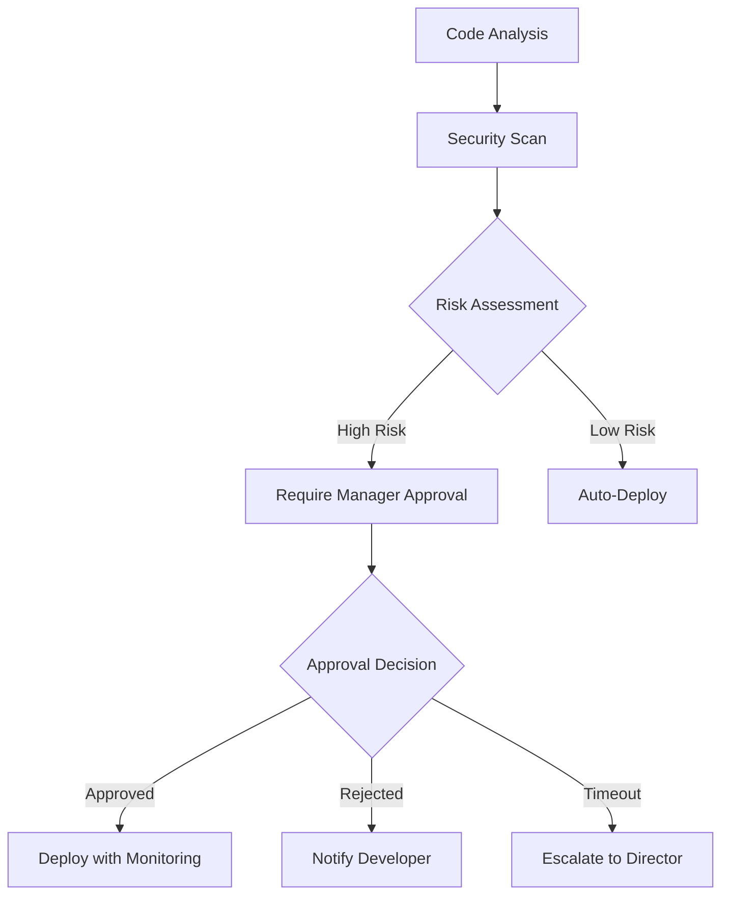

# Approval Workflows Example

**Human-in-the-loop workflow with conditional approval gates**

This example demonstrates how to build workflows that require human approval at critical decision points, perfect for sensitive operations, compliance requirements, or quality gates.

## 🎯 What You'll Learn

- Human approval node implementation
- Conditional workflow branching based on approval decisions
- Timeout handling for approval requests
- Risk assessment and escalation patterns
- Audit trail creation

## 📋 Workflow Overview



**Workflow Steps:**

1. **Analysis** - AI analyzes code changes for complexity and impact
2. **Security Scan** - Automated security vulnerability assessment
3. **Risk Assessment** - Conditional routing based on risk level
4. **Human Approval** - Manager review for high-risk changes
5. **Deployment** - Conditional deployment with appropriate monitoring
6. **Audit Trail** - Complete record of decisions and approvals

**Expected Duration:** 2-15 minutes (depending on approval time)

## 🚀 Quick Start

### Option 1: Import via UI

1. Open Studio AI at http://localhost:3000
2. Navigate to Workflow Builder
3. Click "Import Workflow"
4. Select `workflow.json` from this directory
5. Click "Execute Workflow"

### Option 2: Run via API

```javascript
// Execute the approval workflow
const result = await fetch('http://localhost:3000/api/workflows/execute', {
  method: 'POST',
  headers: { 'Content-Type': 'application/json' },
  body: JSON.stringify({
    workflow: {
      name: 'Code Deployment Approval',
      steps: [
        {
          id: 'analyze',
          type: 'ai-task',
          provider: 'claude',
          task: 'Analyze the code changes for complexity, risk factors, and potential impact',
        },
        {
          id: 'security-scan',
          type: 'ai-task',
          provider: 'gpt-4',
          task: 'Perform security analysis and identify vulnerabilities',
          deps: ['analyze'],
        },
        {
          id: 'risk-assessment',
          type: 'conditional',
          condition: {
            version: '2.0',
            rootGroup: {
              combinator: 'OR',
              rules: [
                {
                  leftValue: { stepId: 'analyze', field: 'output' },
                  operation: 'contains',
                  rightValue: { type: 'string', value: 'high complexity' },
                },
                {
                  leftValue: { stepId: 'security-scan', field: 'output' },
                  operation: 'contains',
                  rightValue: { type: 'string', value: 'vulnerability' },
                },
              ],
            },
          },
          trueBranch: 'human-approval',
          falseBranch: 'auto-deploy',
          deps: ['security-scan'],
        },
        {
          id: 'human-approval',
          type: 'human-input',
          title: 'Manager Approval Required',
          description: 'High-risk deployment detected. Please review and approve.',
          inputType: 'approval',
          timeout: 900, // 15 minutes
          escalation: 'director-approval',
        },
        {
          id: 'auto-deploy',
          type: 'ai-task',
          task: 'Deploy changes with standard monitoring',
        },
        {
          id: 'approved-deploy',
          type: 'ai-task',
          task: 'Deploy changes with enhanced monitoring and rollback readiness',
          deps: ['human-approval'],
          condition: "approval_status === 'approved'",
        },
      ],
    },
  }),
})
```

## 🔧 Configuration

### Approval Settings

```javascript
// Customize approval behavior
const approvalConfig = {
  // Approval timeout (seconds)
  timeout: 900, // 15 minutes

  // Escalation rules
  escalation: {
    enabled: true,
    escalateTo: 'director-approval',
    escalationTimeout: 1800, // 30 minutes
  },

  // Required approval roles
  approvers: ['manager', 'senior-developer'],

  // Approval criteria
  criteria: {
    requiresReason: true,
    allowDelegation: false,
    requiresSecondary: false, // for critical changes
  },
}
```

### Risk Assessment Rules

```javascript
const riskRules = {
  highRisk: [
    'database migration',
    'authentication changes',
    'payment processing',
    'user data handling',
    'security configuration',
  ],

  mediumRisk: ['API endpoint changes', 'configuration updates', 'dependency updates'],

  lowRisk: ['documentation updates', 'CSS styling', 'logging improvements'],
}
```

## 📊 Expected Output

### High-Risk Scenario

```
1. Analysis: "High complexity database migration detected"
2. Security Scan: "Potential data exposure risk identified"
3. Risk Assessment: HIGH RISK - Routing to human approval
4. Human Approval: Pending manager review...
5. Approval Decision: APPROVED with conditions
6. Enhanced Deployment: Deployed with rollback monitoring
```

### Low-Risk Scenario

```
1. Analysis: "Simple documentation update"
2. Security Scan: "No security concerns identified"
3. Risk Assessment: LOW RISK - Auto-deploying
4. Auto Deploy: Successfully deployed
```

## 🎓 Learning Extensions

### 1. Multi-Level Approvals

Add hierarchical approval chains:

```javascript
{
  id: "director-approval",
  type: "human-input",
  title: "Director Approval Required",
  description: "Manager approval timed out. Director review needed.",
  inputType: "approval",
  requiredRole: "director"
}
```

### 2. Risk Scoring

Implement numeric risk scoring:

```javascript
{
  id: "risk-calculator",
  type: "ai-task",
  task: "Calculate risk score (1-10) based on: {analyze.output} and {security-scan.output}"
}
```

### 3. Audit Logging

Add comprehensive audit trail:

```javascript
{
  id: "audit-log",
  type: "system-task",
  task: "Log approval decision with timestamp, approver, and reasoning",
  deps: ["human-approval"]
}
```

## 🚦 Troubleshooting

### Common Issues

**"Approval request not showing"**

- Check that human-input nodes are properly configured
- Verify approver roles are assigned correctly
- Check WebSocket connection for real-time updates

**"Approval timeout not working"**

- Verify timeout value is in seconds
- Check escalation configuration
- Ensure fallback workflows are defined

**"Risk assessment always routes to approval"**

- Review conditional logic syntax
- Check AI model outputs match expected patterns
- Test with different risk scenarios

### Debug Mode

Enable detailed logging:

```bash
# In browser console
localStorage.setItem('debug', 'approval:*')

# Server-side debugging
DEBUG=approval:* npm run server
```

## 🔗 Related Examples

After mastering approval workflows:

1. **[Multi-Agent Development](../multi-agent-dev/)** - Team coordination patterns
2. **[Testing Automation](../testing-automation/)** - Quality gates and validation
3. **[Data Processing](../data-processing/)** - Batch processing with approvals

## 📝 Workflow File

The complete workflow configuration is available in [`workflow.json`](./workflow.json) in this directory.
