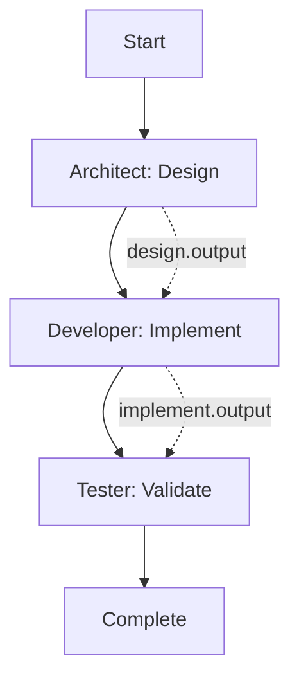

# Multi-Agent Development Example

**Collaborative software development with specialized agent roles**

This example demonstrates a complete software development workflow using multiple agents with different specializations: an architect to design, a developer to implement, and a tester to validate.

## 🎯 What You'll Learn

- Multi-agent coordination and dependencies
- Template variable passing between agents (`{stepId.output}`)
- Sequential workflow execution
- Agent specialization and role separation

## 📋 Workflow Overview



**Steps:**

1. **Architect** - Design the system architecture for a REST API
2. **Developer** - Implement the design from step 1
3. **Tester** - Create tests for the implementation from step 2

**Expected Duration:** 5-10 minutes

## 🚀 Quick Start

### Option 1: Import via UI

1. Open Claude Studio at http://localhost:5173
2. Navigate to Workflow Builder
3. Click "Import Workflow"
4. Select `workflow.json` from this directory
5. Click "Execute Workflow"
6. Watch the agents collaborate in real-time

### Option 2: Run via MCP API

```bash
mcp__studio-ai__invoke({
  workflow: [
    {
      id: "design",
      role: "architect",
      task: "Design a REST API for a simple task management system"
    },
    {
      id: "implement",
      role: "developer",
      task: "Implement the REST API design from the architect: {design.output}",
      deps: ["design"]
    },
    {
      id: "test",
      role: "tester",
      task: "Create comprehensive tests for this implementation: {implement.output}",
      deps: ["implement"]
    }
  ],
  projectId: "multi-agent-example"
})
```

## 🔧 Configuration

### Required Agents

This workflow requires three agent roles in your project:

- `architect` - For system design
- `developer` - For implementation
- `tester` - For quality assurance

### Environment Setup

```bash
# For testing without API costs
USE_MOCK_AI=true

# For production with real AI
USE_MOCK_AI=false
ANTHROPIC_API_KEY=your_key_here
```

## 📊 Expected Output

### Step 1: Architect Output

```markdown
# Task Management REST API Design

## Endpoints

- GET /api/tasks - List all tasks
- POST /api/tasks - Create new task
- GET /api/tasks/:id - Get specific task
- PUT /api/tasks/:id - Update task
- DELETE /api/tasks/:id - Delete task

## Data Model

- Task: { id, title, description, status, createdAt, updatedAt }
- Status: enum ['pending', 'in_progress', 'completed']

## Authentication

- JWT token-based authentication
- Required for all endpoints except GET /api/health
```

### Step 2: Developer Output

```javascript
// Express.js implementation
const express = require('express')
const app = express()

// Task model
class Task {
  constructor(title, description) {
    this.id = Date.now().toString()
    this.title = title
    this.description = description
    this.status = 'pending'
    this.createdAt = new Date()
    this.updatedAt = new Date()
  }
}

// In-memory storage (replace with database)
let tasks = []

// Routes implementation...
app.get('/api/tasks', (req, res) => {
  /* ... */
})
app.post('/api/tasks', (req, res) => {
  /* ... */
})
// ... etc
```

### Step 3: Tester Output

```javascript
// Jest test suite
const request = require('supertest')
const app = require('./app')

describe('Task Management API', () => {
  test('GET /api/tasks returns empty array initially', async () => {
    const response = await request(app).get('/api/tasks')
    expect(response.status).toBe(200)
    expect(response.body).toEqual([])
  })

  test('POST /api/tasks creates new task', async () => {
    const newTask = { title: 'Test Task', description: 'Test Description' }
    const response = await request(app).post('/api/tasks').send(newTask)
    expect(response.status).toBe(201)
    expect(response.body).toHaveProperty('id')
  })
  // ... more tests
})
```

## 🔍 Key Features Demonstrated

### 1. Dependency Management

```json
{
  "id": "implement",
  "deps": ["design"]
}
```

The developer waits for the architect to complete before starting.

### 2. Template Variables

```json
{
  "task": "Implement this design: {design.output}"
}
```

The architect's output is automatically passed to the developer.

### 3. Sequential Execution

Each agent builds upon the previous agent's work, creating a natural development flow.

### 4. Role Specialization

- **Architect**: Focuses on high-level design and structure
- **Developer**: Handles implementation details and code
- **Tester**: Creates validation and quality assurance

## 🎓 Learning Extensions

### 1. Add Code Review

```json
{
  "id": "review",
  "role": "reviewer",
  "task": "Review the implementation and tests: {implement.output} and {test.output}",
  "deps": ["implement", "test"]
}
```

### 2. Add Documentation

```json
{
  "id": "document",
  "role": "developer",
  "task": "Create API documentation for: {implement.output}",
  "deps": ["implement"]
}
```

### 3. Parallel Testing

```json
{
  "id": "unit_tests",
  "role": "tester",
  "task": "Create unit tests for: {implement.output}",
  "deps": ["implement"]
},
{
  "id": "integration_tests",
  "role": "tester",
  "task": "Create integration tests for: {implement.output}",
  "deps": ["implement"]
}
```

## 🚦 Troubleshooting

### Common Issues

**"Template variable {design.output} not found"**

- Ensure the `design` step completed successfully
- Check the step ID matches exactly
- Verify dependencies are set correctly

**"Agent 'architect' not found"**

- Add the required agent roles to your project
- Check agent configurations in Settings

**"Workflow stuck on first step"**

- Check API connectivity and keys
- Verify agent has proper permissions
- Review browser console for errors

### Debug Template Variables

Add a debug step to see what's being passed:

```json
{
  "id": "debug",
  "role": "developer",
  "task": "Debug: Here's what I received from architect: {design.output}",
  "deps": ["design"]
}
```

## 🔗 Next Steps

After mastering multi-agent coordination:

1. **[Approval Workflows](../approval-workflows/)** - Add human oversight
2. **[Data Processing](../data-processing/)** - Learn loops and iteration
3. **[Testing Automation](../testing-automation/)** - Advanced quality gates
4. **Build Complex Systems** - Combine multiple patterns

## 📝 Files

- [`workflow.json`](./workflow.json) - Complete workflow definition
- [`variations/`](./variations/) - Alternative workflow patterns
