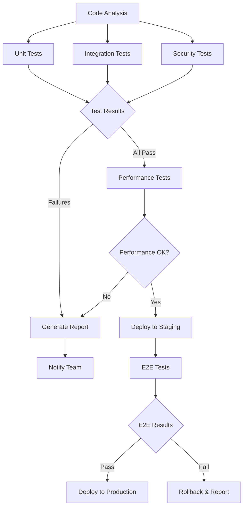

# Testing Automation Example

**Comprehensive quality assurance workflow with automated testing and conditional execution**

This example demonstrates how to build sophisticated testing workflows that automatically validate code quality, run different test suites based on changes, and provide detailed reporting with conditional deployment decisions.

## 🎯 What You'll Learn

- Multi-level testing strategy implementation
- Conditional test execution based on code changes
- Parallel test suite execution
- Test result analysis and reporting
- Quality gate enforcement
- Automated deployment decisions

## 📋 Workflow Overview



**Workflow Features:**

- **Smart Test Selection** - Only runs relevant tests based on code changes
- **Parallel Execution** - Multiple test suites run simultaneously
- **Quality Gates** - Automated pass/fail decisions
- **Performance Validation** - Load testing for critical changes
- **Comprehensive Reporting** - Detailed test results and metrics
- **Automated Deployment** - Conditional deployment based on test outcomes

**Expected Duration:** 3-10 minutes (depending on test suite size)

## 🚀 Quick Start

### Option 1: Import via UI

1. Open Studio AI at http://localhost:3000
2. Navigate to Workflow Builder
3. Click "Import Workflow"
4. Select `workflow.json` from this directory
5. Configure your test commands and thresholds
6. Click "Execute Workflow"

### Option 2: Run via API

```javascript
// Execute the testing workflow
const result = await fetch('http://localhost:3000/api/workflows/execute', {
  method: 'POST',
  headers: { 'Content-Type': 'application/json' },
  body: JSON.stringify({
    workflow: {
      name: 'Comprehensive Testing Pipeline',
      steps: [
        {
          id: 'analyze-changes',
          type: 'ai-task',
          provider: 'claude',
          task: 'Analyze code changes and determine which test suites are needed. Consider: file types changed, modules affected, risk level.',
        },
        {
          id: 'unit-tests',
          type: 'parallel-group',
          tasks: [
            {
              id: 'frontend-unit',
              task: 'Run frontend unit tests: npm run test:unit:frontend',
            },
            {
              id: 'backend-unit',
              task: 'Run backend unit tests: npm run test:unit:backend',
            },
          ],
          deps: ['analyze-changes'],
        },
        {
          id: 'integration-tests',
          type: 'ai-task',
          task: 'Run integration tests based on analysis: {analyze-changes.output}',
          deps: ['unit-tests'],
        },
        {
          id: 'quality-gate',
          type: 'conditional',
          condition: {
            version: '2.0',
            rootGroup: {
              combinator: 'AND',
              rules: [
                {
                  leftValue: { stepId: 'unit-tests', field: 'output' },
                  operation: 'contains',
                  rightValue: { type: 'string', value: 'PASS' },
                },
                {
                  leftValue: { stepId: 'integration-tests', field: 'output' },
                  operation: 'contains',
                  rightValue: { type: 'string', value: 'PASS' },
                },
              ],
            },
          },
          trueBranch: 'performance-tests',
          falseBranch: 'generate-failure-report',
          deps: ['integration-tests'],
        },
      ],
    },
  }),
})
```

## 🔧 Configuration

### Test Suite Configuration

```javascript
const testConfig = {
  // Test execution settings
  parallel: true,
  maxConcurrency: 4,
  timeout: 300, // 5 minutes per test suite

  // Test selection rules
  testSelection: {
    'frontend/**': ['unit:frontend', 'e2e:frontend'],
    'backend/**': ['unit:backend', 'integration:api'],
    'database/**': ['integration:db', 'migration:test'],
    'security/**': ['security:scan', 'security:audit'],
  },

  // Quality gates
  qualityGates: {
    unitTestCoverage: 80,
    integrationTestPass: 100,
    performanceThreshold: 2000, // ms
    securityScanPass: true,
  },
}
```

### Performance Testing

```javascript
const performanceConfig = {
  // Load testing parameters
  loadTest: {
    users: 100,
    duration: '2m',
    rampUp: '30s',
  },

  // Performance thresholds
  thresholds: {
    responseTime: 2000, // ms
    errorRate: 0.01, // 1%
    throughput: 100, // requests/sec
  },

  // Critical endpoints to test
  endpoints: ['/api/auth/login', '/api/workflows/execute', '/api/agents/create'],
}
```

## 📊 Expected Output

### Successful Test Run

```
1. Code Analysis: "Frontend components and API routes modified"
2. Unit Tests:
   - Frontend: 45/45 tests PASSED (95% coverage)
   - Backend: 123/123 tests PASSED (87% coverage)
3. Integration Tests: 23/23 API tests PASSED
4. Quality Gate: ALL TESTS PASSED - Proceeding to performance
5. Performance Tests: Average response time 450ms ✓
6. E2E Tests: 15/15 user journey tests PASSED
7. Deployment: APPROVED for production deployment
```

### Failed Test Run

```
1. Code Analysis: "Database schema and authentication modified"
2. Unit Tests:
   - Frontend: 45/45 tests PASSED (95% coverage)
   - Backend: 120/123 tests FAILED (3 authentication tests failed)
3. Integration Tests: SKIPPED due to unit test failures
4. Quality Gate: FAILED - Unit tests must pass
5. Failure Report: Generated detailed report with 3 failing tests
6. Team Notification: Sent to #dev-team with failure details
7. Deployment: BLOCKED - Fix tests before deploying
```

## 🎓 Learning Extensions

### 1. Smart Test Selection

Implement intelligent test selection based on code changes:

```javascript
{
  id: "test-selector",
  type: "ai-task",
  task: "Analyze git diff and determine minimum viable test suite. Rules: {testSelection} Changes: {git-diff.output}"
}
```

### 2. Flaky Test Detection

Add flaky test identification and handling:

```javascript
{
  id: "flaky-test-detector",
  type: "ai-task",
  task: "Analyze test history and identify flaky tests. Re-run failed tests up to 3 times before marking as true failure."
}
```

### 3. Performance Regression Detection

Implement performance comparison:

```javascript
{
  id: "perf-comparison",
  type: "ai-task",
  task: "Compare current performance metrics with baseline: {performance-baseline.output} vs {performance-tests.output}"
}
```

### 4. Visual Regression Testing

Add visual testing for UI changes:

```javascript
{
  id: "visual-tests",
  type: "system-task",
  task: "Run visual regression tests using Playwright screenshots",
  condition: "frontend files modified"
}
```

## 🚦 Troubleshooting

### Common Issues

**"Tests timing out"**

- Increase timeout values in test configuration
- Check for resource contention during parallel execution
- Verify test database is properly isolated

**"Inconsistent test results"**

- Implement test isolation and cleanup
- Check for race conditions in parallel tests
- Review test data setup and teardown

**"Performance tests failing"**

- Verify performance test environment consistency
- Check for background processes affecting results
- Review performance thresholds for realism

### Debug Commands

```bash
# Run individual test suites
npm run test:unit -- --verbose
npm run test:integration -- --coverage
npm run test:e2e -- --headed

# Performance testing
npm run test:load -- --users 50 --duration 1m

# Test with debugging
DEBUG=test:* npm run test:all
```

## 🔗 Integration Examples

### CI/CD Integration

```yaml
# GitHub Actions example
name: Studio AI Testing
on: [push, pull_request]

jobs:
  test:
    runs-on: ubuntu-latest
    steps:
      - uses: actions/checkout@v3
      - name: Run Studio AI Tests
        run: |
          curl -X POST http://studio-ai:3000/api/workflows/execute \
            -H "Content-Type: application/json" \
            -d @examples/testing-automation/workflow.json
```

### Slack Integration

```javascript
{
  id: "notify-team",
  type: "webhook",
  url: "https://hooks.slack.com/your-webhook",
  payload: {
    channel: "#dev-team",
    text: "Test Results: {quality-gate.output}",
    attachments: [{
      color: "good",
      fields: [{
        title: "Test Coverage",
        value: "{unit-tests.coverage}%"
      }]
    }]
  }
}
```

## 🔗 Related Examples

After mastering testing automation:

1. **[Approval Workflows](../approval-workflows/)** - Add human oversight to deployments
2. **[Multi-Agent Development](../multi-agent-dev/)** - Team-based development workflows
3. **[Data Processing](../data-processing/)** - Automated data validation and testing

## 📝 Workflow File

The complete workflow configuration is available in [`workflow.json`](./workflow.json) in this directory.
